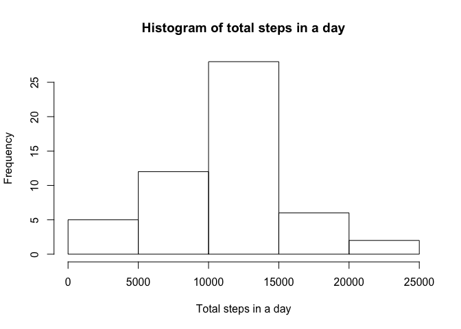
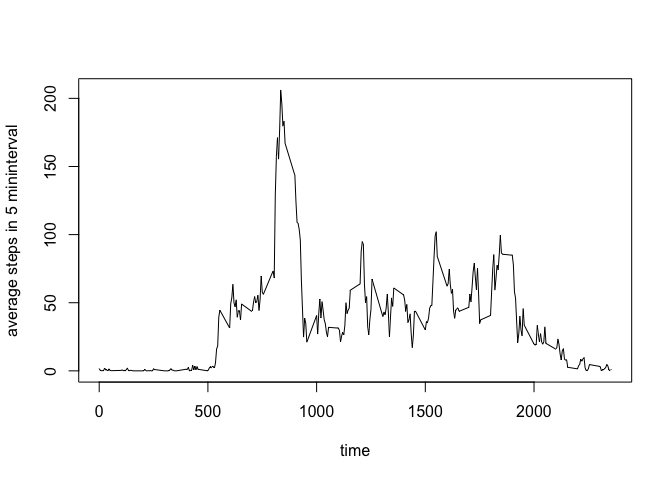
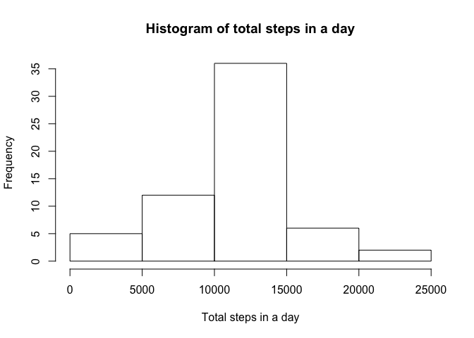
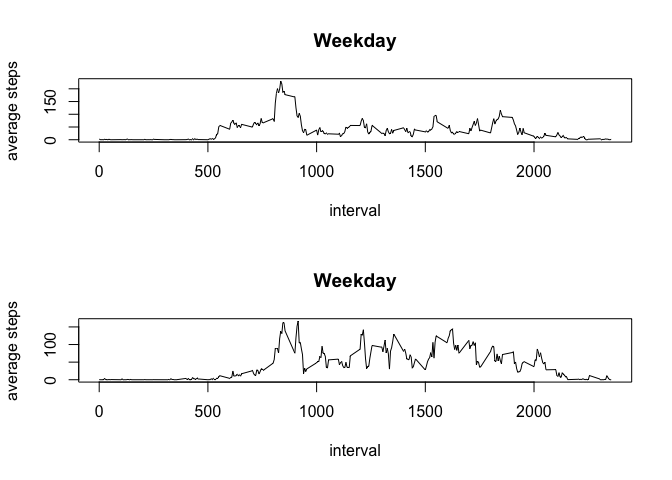

# Reproducible Research: Peer Assessment 1


## Loading and preprocessing the data
Show any code that is needed to load the data.


Process/transform the data (if necessary) into a format suitable for your analysis.


```r
activity <- read.csv("activity.csv", header = TRUE)

for (i in 1:17568){
    if (as.integer(activity[i,"interval"]) < 10) {
        activity[i, "interval"] = paste ("000", as.character(activity[i, "interval"]), sep="")
    }
    else if (as.integer(activity[i,"interval"]) < 100) {
        activity[i, "interval"] = paste ("00", as.character(activity[i, "interval"]), sep="")
    }
    else if (as.integer(activity[i,"interval"]) < 1000) {
        activity[i, "interval"] = paste ("0", as.character(activity[i, "interval"]), sep="")
    }
    else {
        activity[i, "interval"] =as.character(activity[i, "interval"])
    }
}
activity$date_time <- strptime(paste(as.character(activity$date)," ", activity$interval, sep = ""), format = "%Y-%m-%d %H%M")
```

## What is mean total number of steps taken per day?
For this part of the assignment, you can ignore the missing values in the dataset.

1. Calculate the total number of steps taken per day


```r
activity_day <- aggregate(activity$steps, by=list(activity$date), FUN = sum)
```

2. Make a histogram of the total number of steps taken each day


```r
hist(activity_day$x, main = "Histogram of total steps in a day", xlab = "Total steps in a day")
```

 

3. Calculate and report the mean and median of the total number of steps taken per day


```r
mean <- mean(activity_day$x, na.rm = TRUE)
median <- median(activity_day$x, na.rm = TRUE)
```

The mean is 1.0766189\times 10^{4}.
The median is 10765.

## What is the average daily activity pattern?

1. Make a time series plot (i.e. type = "l") of the 5-minute interval (x-axis) and the average number of steps taken, averaged across all days (y-axis).


```r
activity_daily <- aggregate(activity$steps, by=list(activity$interval), FUN= mean, na.rm=TRUE )
plot(activity_daily$Group.1, activity_daily$x, type="l", xlab = "time", ylab = "average steps in 5 mininterval")
```

 

2. Which 5-minute interval, on average across all the days in the dataset, contains the maximum number of steps?


```r
library(nnet)
max_daily <- activity_daily[which.is.max(activity_daily$x),]
```

The interval when max number of steps happens is 0835 .

## Imputing missing values
Note that there are a number of days/intervals where there are missing values (coded as NA). The presence of missing days may introduce bias into some calculations or summaries of the data.

1. Calculate and report the total number of missing values in the dataset (i.e. the total number of rows with NAs)


```r
missing <- is.na(activity$steps)
num_na <- nrow(activity[missing,])
```
Total number of missing values in dataset is 2304.


2. Devise a strategy for filling in all of the missing values in the dataset. The strategy does not need to be sophisticated. For example, you could use the mean/median for that day, or the mean for that 5-minute interval, etc.

My strategy is to fill in the missing values mean value of interval and create a dataset called activity_new.

```r
data1 <- activity[1,]

for (i in levels(as.factor(activity$interval))) {
    data <- activity[as.factor(activity$interval)==i,]
    library(plyr)
    fill.missing <- function(x) replace(x, is.na(x), mean(x, na.rm = TRUE))
    dat2 <- sapply(data, function(x){
        if(is.numeric(x)){
            fill.missing(x)
        } else {
            x
        }
    }
    )
    
    data2 <- data.frame(dat2)  
    data1 <- rbind(data1,data2)
    
}
activity_new <- data1[2:17569,]
activity_new <-activity_new[with(activity_new, order(date)),]
activity_new$steps <-as.numeric(activity_new$steps)
```

3. Calculating mean and median total number of steps taken per day.


```r
activity_day_new <- aggregate(activity_new$steps, by=list(activity_new$date), FUN = sum)
hist(activity_day_new$x, main = "Histogram of total steps in a day", xlab = "Total steps in a day")
```

 

```r
mean_new <- mean(activity_day_new$x, na.rm = TRUE)
median_new <- median(activity_day_new$x, na.rm = TRUE)
```

The mean is 1.0766189\times 10^{4} and the median is 1.0766189\times 10^{4}.
There's no change in mean value because my strategy is to fill with the mean value; there is a small change on the median value.

## Are there differences in activity patterns between weekdays and weekends?

1. We'll create a new factor variable called "weekday" with two levels: "weekday" and "weekend" in activity_new dataset.


```r
for (i in 1:17568){
    activity_new[i,"weekday"] <- weekdays(as.Date(activity_new[i,"date"]))
    if (activity_new[i,"weekday"] == "Sunday" | activity_new[i,"weekday"] == "Saturday") {
        activity_new[i,"weekday"] <- "weekend"
    }
    else {
        activity_new[i,"weekday"] <- "weekday"
    }
}
activity_new$weekday <- as.factor(activity_new$weekday)
```

2. Make a panel plot containing a time series plot (i.e. type = "l") of the 5-minute interval (x-axis) and the average number of steps taken, averaged across all weekday days or weekend days (y-axis).


```r
activity_weekend <- activity_new[activity_new$weekday=="weekend",]
activity_weekday <- activity_new[activity_new$weekday=="weekday",]
activity_daily_weekday <- aggregate(activity_weekday$steps, by=list(activity_weekday$interval), FUN= mean )
activity_daily_weekend <- aggregate(activity_weekend$steps, by=list(activity_weekend$interval), FUN= mean )
par(mfrow =c(2,1))
plot(activity_daily_weekday$Group.1, activity_daily_weekday$x, main = "Weekday", type = "n", xlab = "interval", ylab = "average steps")
lines(activity_daily_weekday$Group.1, activity_daily_weekday$x)
plot(activity_daily_weekend$Group.1, activity_daily_weekend$x, main = "Weekday", type = "n", xlab = "interval", ylab = "average steps")
lines(activity_daily_weekend$Group.1, activity_daily_weekend$x)
```

 
